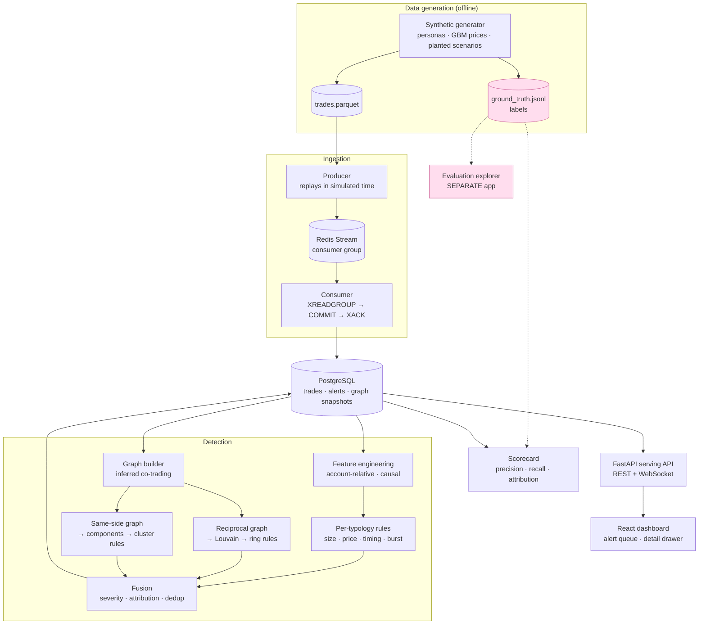
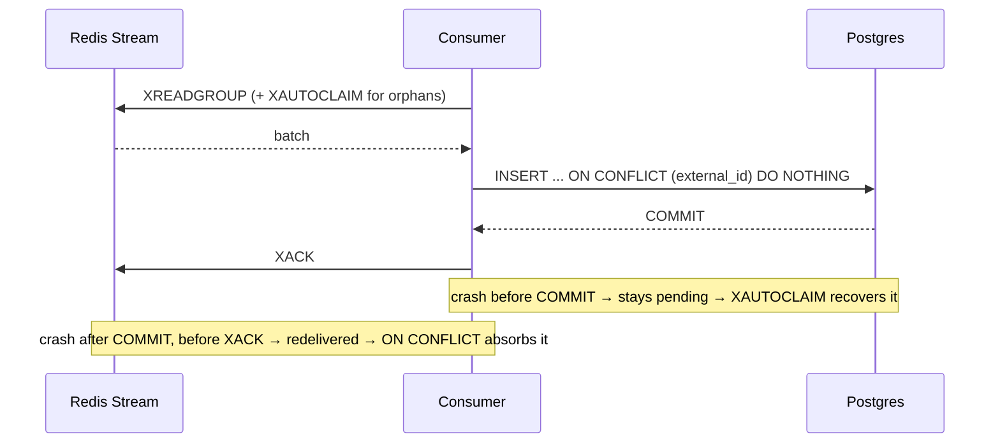

# Architecture

## System

**The dotted lines matter.** Ground truth reaches only the evaluation harness and the
explorer — never the detectors, never the serving API. That boundary is enforced by
`tests/test_detection_isolation.py`, which parses the AST of every detection module, and
by `test_serving_api_exposes_no_ground_truth`.

## Why the explorer is a separate application

The explorer reads labels so a human can audit what was planted. The serving API must not.
Running them as one process would make that separation a matter of discipline; running them
as two applications makes it architectural. In Docker Compose they are separate services;
in development the Vite proxy routes the two path prefixes to different ports.

## Ingestion: how exactly-once actually works

Redis Streams give **at-least-once** delivery. Combined with an **idempotent write** that
is enough, and it is the achievable version of the property — true exactly-once across two
systems needs a distributed transaction. Acking before committing would invert the
guarantee and silently lose a batch on every crash.

## Two detection layers, and why neither is redundant

| Typology | Per-trade layer | Graph layer |
|---|---|---|
| Size spike | **86%** | — |
| Off-market price | **70%** | — |
| Order burst | **100%** | — |
| Out-of-pattern timing | 0% | — |
| Wash ring | **0%** | **100%** |
| Coordinated cluster | **0%** | **80%** |

Wash rings are planted so every trade is ordinary for the account that placed it. The
per-trade layer cannot see them by construction, and the graph layer finds all of them
without ever reading counterparty identity. That contrast is the system's reason to exist.

## Services

| Service | Port | Purpose |
|---|---|---|
| `api` | 8000 | Serving API + dashboard. No ground-truth access |
| `explorer` | 8011 → 8001 | Evaluation-side dataset explorer. Reads labels, served under `/explorer/*` |
| `worker` | — | Redis Streams consumer → Postgres |
| `bootstrap` | — | One-shot: migrate, generate, load, detect |
| `postgres` | 55432 → 5432 | Trades, alerts, graph snapshots |
| `redis` | 56379 → 6379 | Trade stream |

Bring-up order is enforced with health checks and `depends_on: condition:` rather than
sleeps, so a fresh `docker compose up` lands on a populated system instead of an empty
dashboard that looks broken.
